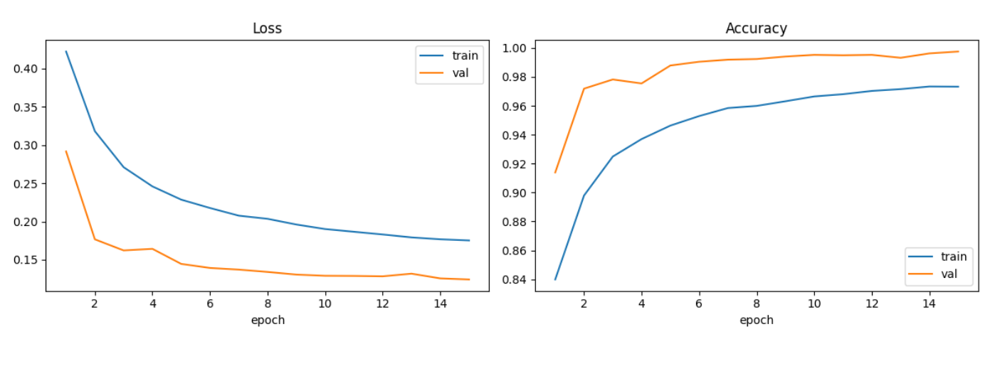
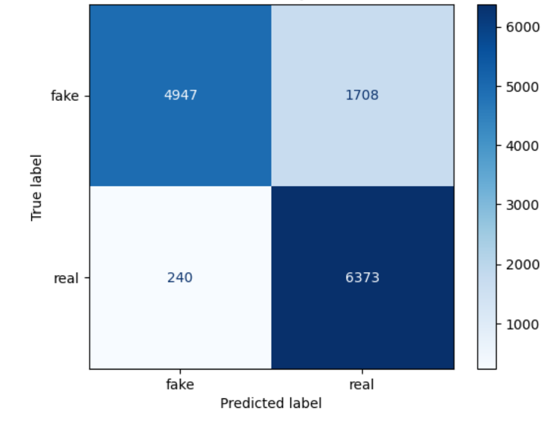

# Fake_audio_detection

Diego Alfaro - A01709971

**Detección de audios falsos (deepfake) generados con IA, utilizando IA.**

Este proyecto entrena un modelo híbrido **CNN–BiLSTM** que escucha un audio de voz y
decide si es **real** (una persona de verdad) o **falso/fake** (generado o manipulado por
computadora). Fue creado y ejecutado en Kaggle.

[Dataset: The Fake-or-Real (FoR) Dataset](https://www.kaggle.com/datasets/mohammedabdeldayem/the-fake-or-real-dataset)

---

## Contenido del repositorio

| Archivo / carpeta                 | Qué es                                                                                                                   |
| --------------------------------- | ------------------------------------------------------------------------------------------------------------------------ |
| `Fake_Audio_Detecion_Model.ipynb` | Notebook de **entrenamiento** del modelo.                                                                                |
| `Fake_Audio_Usage.ipynb`          | Notebook de **uso**: cargar un audio cualquiera y predecir.                                                              |
| `pruebas_modelo.py`               | Script para **evaluar** el modelo y generar las métricas. (tiene que usarse con elementos del notebook de entrenamiento) |
| `pesos/checkpoint_15.keras`       | Pesos del mejor modelo entrenado.                                                                                        |
| `metricas/`                       | Resultados (`metricas.txt`) y gráficas.                                                                                  |
| `test/`                           | Audios de ejemplo para probar el modelo.                                                                                 |

---

## Notebook `Fake_Audio_Detecion_Model.ipynb` (entrenamiento)

Este notebook entrena el modelo que "escucha" un audio de voz y decide si es **real** o **fake**.

### 1. Preparar las herramientas

Se cargan las librerías necesarias (**TensorFlow** para el modelo, **librosa** para el audio,
**matplotlib** para las gráficas) y se revisa si hay una tarjeta gráfica (GPU) disponible
para entrenar más rápido.

### 2. Convertir el sonido en una "imagen"

La computadora no entiende el sonido directamente, así que cada audio se transforma en un
**espectrograma de Mel**: una especie de imagen que muestra qué tonos suenan y en qué momento.

El proceso sigue estos pasos:

1. **Cargar el audio** a 22 050 Hz y en un solo canal (mono). Se descartan archivos vacíos o muy cortos.
2. **STFT** (Transformada de Fourier de tiempo corto) con ventana de Hann de 2 048 y salto de 512 muestras.
3. **Escala de Mel**: se reducen las 1 025 frecuencias a **128 bandas de Mel** (más parecidas a cómo oye el humano).
4. **Decibeles y normalización**: se pasa a escala logarítmica, se normaliza al pico y se recorta a 80 dB de rango.
5. **Tamaño fijo**: todo se ajusta a una imagen de **128 × 128** rellenando con silencio (−80 dB) si hace falta.

El resultado es una matriz de `128 × 128 × 1` por cada audio. La etiqueta es **1 = real** y **0 = falso**.

### 3. Organizar los datos

El dataset trae dos versiones de los mismos audios: `for-norm` (audios normalizados) y
`for-rerec` (los mismos audios **re-grabados**, es decir, reproducidos y vueltos a capturar con
micrófono, lo que añade ruido y condiciones reales). El notebook usa esto a su favor:

- **Entrenamiento + Validación:** salen de **`for-norm`**. Las listas de audios real y fake se
  barajan con una semilla fija (`Random(42)`, para que el experimento sea reproducible) y se parten
  en **90 % entrenamiento / 10 % validación**.
- **Prueba (testing):** sale **completa de `for-rerec`**, una versión que el modelo **nunca vio**
  durante el entrenamiento. Probar con audios re-grabados es una prueba **más difícil y más justa**:
  comprueba que el modelo de verdad aprendió a distinguir voces, y no solo memorizó la grabación.

Cantidad de audios en cada grupo (real / fake):

| Grupo                | Real   | Fake   |
| -------------------- | ------ | ------ |
| Entrenamiento        | 31 144 | 31 225 |
| Validación           | 3 461  | 3 470  |
| Prueba (`for-rerec`) | 6 613  | 6 655  |

### 4. Crear variaciones de los audios (data augmentation)

Solo durante el entrenamiento se le agregan augmentaciones a cada audio para que el modelo sea más
fuerte y no se confunda con sonidos imperfectos. Hay dos tipos:

**Sobre el sonido (waveform), de forma aleatoria:**

- **Ruido de fondo** (probabilidad 60 %): se añade ruido con un nivel señal/ruido entre 5 y 25 dB.
- **Filtro pasa-bajos** (40 %): se quitan las frecuencias más altas, como cuando un audio suena "apagado".
- **Eco / reverberación** (30 %): se simula que el audio se grabó en una sala con eco.

**Sobre la "imagen" del espectrograma (SpecAugment):**

- Se **tapan franjas** de frecuencias (hasta 2 bandas de máx. 16 de alto) y de tiempo (hasta 2 franjas
  de máx. 16 de ancho), obligando al modelo a no depender de una sola zona.

Como el entrenamiento **no se guarda en caché**, en cada época se generan variaciones distintas, así el
modelo ve mucha más variedad. La validación y la prueba **no** se modifican.

### 5. El modelo

Es una combinación de dos tipos de red:

- **CNN (3 bloques convolucionales):** buscan patrones en la imagen del audio. Usan 32, 64 y 128
  filtros, cada bloque con `BatchNormalization`, `ReLU`, `MaxPooling` y un `SpatialDropout2D(0.1)`
  (apaga al azar algunos mapas para evitar sobreajuste), reduciendo la imagen de 128×128 a 16×16.
- **Puente CNN → RNN:** la imagen reducida se reorganiza en una secuencia de 16 pasos de tiempo.
- **BiLSTM (2 capas bidireccionales):** analizan cómo cambia el sonido a lo largo del tiempo,
  mirando tanto el pasado como el futuro de la señal. Entre ambas hay un `Dropout(0.3)`.
- **Clasificador:** una capa `Dense(64)` + `Dropout(0.4)` y al final una `Dense(1, sigmoid)`.

En total el modelo tiene unos **1.22 millones de parámetros**.

El modelo da un número entre 0 y 1:

- Cercano a **0 → audio falso (fake)**.
- Cercano a **1 → audio real**.

También se usa una capa propia (`PerSampleStandardization`) que normaliza cada audio, y **pesos de
clase** para arreglar el problema de que hay más audios de un tipo que de otro, y así el modelo no
se va "de lado".

### 6. Entrenamiento

El modelo se compila con el optimizador **AdamW** (`learning_rate = 1e-4`, `weight_decay = 1e-4`),
que suele generalizar mejor que Adam clásico [4]. La pérdida es **entropía cruzada binaria con label
smoothing de 0.05** (suaviza las etiquetas para que el modelo no se confíe de más). Para contrarrestar
el pequeño desbalance entre clases se usan **pesos de clase** inversamente proporcionales a la
frecuencia de cada etiqueta.

El entrenamiento corre por **15 épocas**, con dos ayudas automáticas:

- **EarlyStopping:** vigila el AUC de validación y se **detendría solo** si dejara de mejorar (paciencia de 5 épocas), restaurando los mejores pesos.
- **ReduceLROnPlateau:** si la pérdida de validación se estanca (paciencia de 3 épocas), **baja la velocidad de aprendizaje** a la mitad (hasta un mínimo de 1e-5) para afinar mejor.

Además, en cada época se **guarda automáticamente** el mejor modelo (`ModelCheckpoint`), de donde sale
`checkpoint_15.keras`.

### 7. Evaluación

Al final se mide el desempeño con los audios de prueba (que el modelo nunca vio) usando varias métricas:

- **Accuracy:** qué porcentaje acertó.
- **Precision y Recall:** qué tan confiable es al decir "real" o "fake".
- **F1 (macro):** un balance entre las dos anteriores, tratando ambas clases por igual.
- **AUC:** qué tan bien separa lo real de lo falso (robusta al desbalance de clases).
- **EER (Equal Error Rate):** el punto donde se igualan los dos tipos de error; es una métrica estándar en detección de audio falso [2].
- **Matriz de confusión:** tabla que muestra los aciertos y los errores.

---

## Notebook `Fake_Audio_Usage.ipynb` (uso del modelo)

Este notebook permite **usar el modelo ya entrenado** con cualquier audio propio.

- Gracias a **FFmpeg**, acepta casi cualquier formato (`mp3`, `mp4`, `m4a`, `aac`, `ogg`, `flac`, `wav`…)
  y lo convierte a mono a 22 050 Hz.
- Aplica **exactamente el mismo preprocesamiento** del entrenamiento (espectrograma de Mel de 128×128).
- Carga los pesos `checkpoint_15.keras` y entrega la predicción.

El modelo devuelve la **probabilidad de que el audio sea real**. Si supera el umbral elegido
(`THRESHOLD = 0.374`), lo marca como **real**; si no, como **fake**.

---

## Resultados

El modelo se evaluó sobre el conjunto de **prueba** (13 268 audios que **nunca vio** durante el
entrenamiento). Estos son los resultados (umbral por defecto = 0.50):

### Métricas del modelo

| Métrica          | Valor       |
| ---------------- | ----------- |
| Accuracy         | **86.75 %** |
| Precision (real) | 81.25 %     |
| Recall (real)    | 95.43 %     |
| F1 (macro)       | 86.66 %     |
| AUC              | **0.957**   |
| EER              | 10.61 %     |

Detalle por clase (umbral 0.50):

| Clase    | Precision | Recall  | F1      | Soporte |
| -------- | --------- | ------- | ------- | ------- |
| fake (0) | 94.51 %   | 78.12 % | 85.54 % | 6 655   |
| real (1) | 81.25 %   | 95.43 % | 87.77 % | 6 613   |

> El umbral también se puede ajustar. En `0.384` (elegido sobre validación para maximizar la F1
> macro) el modelo detecta aún mejor los audios reales (recall 96.4 %), a cambio de unos cuantos
> falsos positivos más. La matriz de confusión de abajo corresponde a este umbral.

### Gráficas

**Pérdida (Loss) y precisión (Accuracy) por época**

Las dos curvas (entrenamiento y validación) **bajan en pérdida y suben en precisión** de forma
estable a lo largo de las **15 épocas**. La validación va siempre por encima en accuracy y por debajo
en pérdida, lo que indica que el modelo **aprende bien y no se sobreajusta**; al final llega a
~97 % de accuracy en entrenamiento y ~99 % en validación.

**Matriz de confusión** (conjunto de prueba)

- **6 373** audios **reales** fueron correctamente identificados como reales; solo **240** se
  confundieron con fake lo que quiere decir que casi nunca falla con voces reales.
- **4 947** audios **falsos** se detectaron bien; **1 708** se colaron como reales.

En resumen: el modelo es **muy bueno reconociendo voces reales** y **bueno detectando audios falsos**.
Su principal área de mejora es reducir los falsos que logran "pasar" como reales.

### Interpretación general

Con un **AUC de 0.957** y un **EER de ~10.6 %**, el modelo separa muy bien lo real de lo falso.
Acierta en aproximadamente **87 de cada 100** audios que nunca había visto, lo cual es un resultado
sólido para esta tarea.

---

## Referencias

[1] S. Chapagain, B. Thapa, S. Man Singh Baidhya, S. B.K. y S. Thapa, "Deep Fake Audio Detection
Using a Hybrid CNN-BiLSTM Model with Attention Mechanism," _International Journal on Engineering
Technology_, vol. 2, pp. 204–214, 2025. doi: 10.3126/injet.v2i2.78619.

[2] T. M. Wani, R. Gulzar e I. Amerini, "ABC-CapsNet: Attention based Cascaded Capsule Network for
Audio Deepfake Detection," _2024 IEEE/CVF Conference on Computer Vision and Pattern Recognition
Workshops (CVPRW)_, Seattle, WA, USA, 2024, pp. 2464–2472. doi: 10.1109/CVPRW63382.2024.00253.

[3] _Audio Deepfake Detection_ (preimpresión), arXiv:2509.07132. Disponible en: https://arxiv.org/abs/2509.07132.

[4] Y. Yassin, "Adam vs AdamW: Understanding Weight Decay and Its Impact on Model Performance,"
_Medium_, 2024. Disponible en: https://yassin01.medium.com/adam-vs-adamw-understanding-weight-decay-and-its-impact-on-model-performance-b7414f0af8a1.
